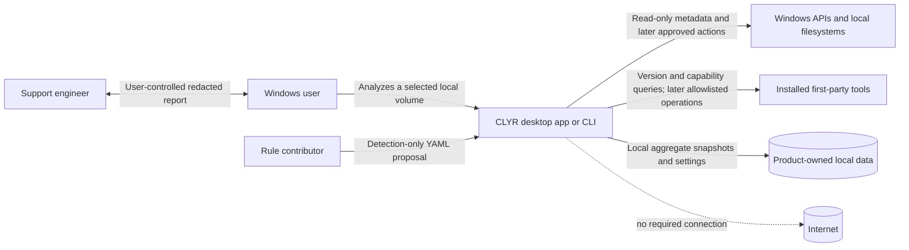
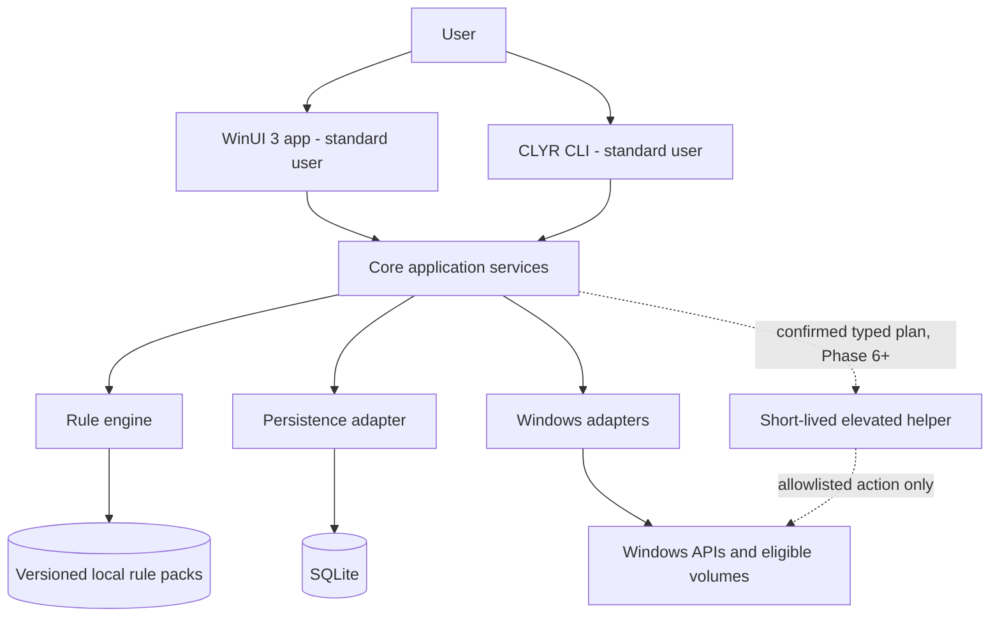
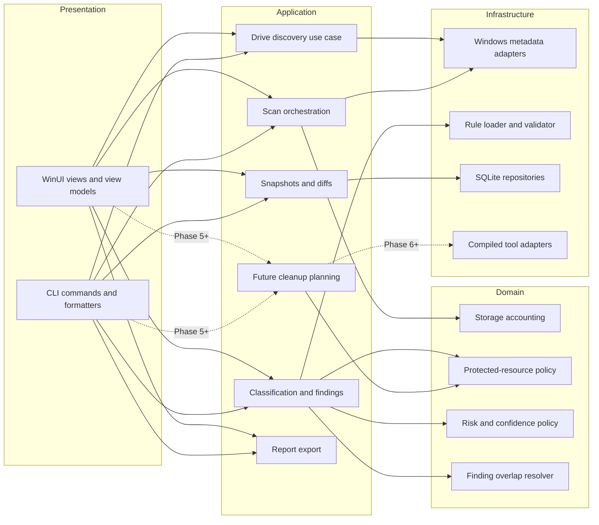
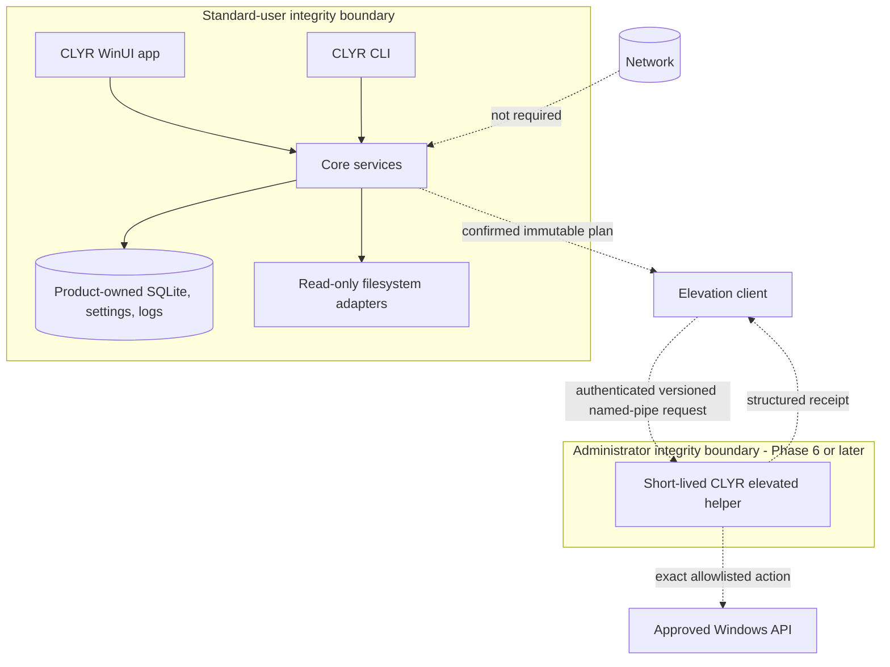

# Architecture

## Status and scope

This document preserves the Phase 0 architecture contract and records the Phase 1 implementation subset. Phase 1 now provides the typed contracts, UI-independent core, explicit SQLite persistence foundation, bounded detection-only rule validator, Windows environment/logging adapters, restricted CLI, and non-elevated WinUI demo shell. Drive discovery, scanning, cleanup, movement, process execution, and elevation remain unimplemented.

## Context

The user controls scans, exports, and every future action. CLYR reads local filesystem/system metadata, loads local versioned rules, and stores minimized product-owned data. It has no required internet connection. A support engineer receives a report only through the user's explicit sharing decision.

Authoritative source: `docs/diagrams/context.mmd`.

## Containers and trust boundaries

Authoritative source: `docs/diagrams/containers.mmd`. The app and CLI run at standard-user integrity. The future helper is not a service or startup task; it is launched only for a confirmed eligible plan, authenticates both ends, revalidates the full batch, returns a receipt, and exits.

## Component model

Authoritative source: `docs/diagrams/components.mmd`.

## Planned solution responsibilities

| Project | Owns | Must not own |
|---|---|---|
| `Clyr.App` | WinUI 3 views, MVVM state, navigation, accessibility, user confirmation surfaces | Filesystem mutation, SQL, process invocation, rule parsing |
| `Clyr.Cli` | Command parsing, stable/versioned text and JSON output, exit codes | Independent business logic, shell interpolation |
| `Clyr.Core` | Use cases, scan orchestration, aggregation, classification, overlap, snapshots, risk/protection, future plan generation | WinUI, concrete SQLite/Win32/process dependencies |
| `Clyr.Contracts` | Versioned DTOs/enums/strong IDs used across process/surface boundaries | Mutable service state, adapters, policy implementation |
| `Clyr.Persistence` | SQLite migrations, transactional repositories, integrity/retention/recovery | Full file index by default, filesystem actions |
| `Clyr.Rules` | Bounded YAML parse, JSON Schema validation, pack manifest/integrity, deterministic compilation | Arbitrary executables or action bypass |
| `Clyr.Windows` | Drive/filesystem/cloud metadata, allocated size, known folders, Recycle Bin, package/tool/elevation adapters | Product decisions or UI state |
| `Clyr.ElevatedHelper` | Minimal future typed capability execution and receipt | Generic shell, arbitrary paths/commands, persistence/listener |

## Dependency rules

1. `Clyr.Core` may depend on `Clyr.Contracts` and its own abstractions; it must run in tests without Windows UI or a real filesystem.
2. `Clyr.App` and `Clyr.Cli` depend on application interfaces, not infrastructure implementations.
3. `Clyr.Persistence`, `Clyr.Rules`, and `Clyr.Windows` implement inward-facing interfaces. Infrastructure may depend inward; Core never depends outward.
4. `Clyr.ElevatedHelper` depends only on the minimal versioned contract, protection/validation library, and narrowly required Windows adapters. It must not reference App, CLI, Persistence, community-rule loaders, or generic process helpers.
5. Cross-process payloads are DTOs, not serialized domain objects. Unknown protocol versions fail closed.
6. All process execution lives in compiled first-party adapters using direct executable launch with an argument list. No layer exposes a generic command runner.
7. UI-thread work is presentation only. Long I/O is cancellable and reports throttled immutable progress snapshots.
8. Architecture tests in Phase 1 enforce these references and forbidden namespaces/APIs.

## Process boundary

Authoritative source: `docs/diagrams/process-boundaries.mmd`. A named pipe is a transport, not authentication; `SECURE_IPC.md` defines identity, nonce, expiry, capability, size, and replay requirements.

## Data flow and privacy

Filesystem adapters emit safe metadata observations into a bounded aggregation pipeline. The rule engine evaluates aggregates/known roots without taking action. Protection policy is applied before disposition and again in every future plan/action stage. Persistence receives category aggregates, top-N redacted evidence, findings, coverage, and schema/rule versions—not file content or a permanent complete filename index. Export is generated from a privacy-filtered model, validated, previewed, and written only to a user-selected location.

Raw paths are sensitive transient data. Summary reports and logs use redacted tokens; detailed paths require explicit local-only export. Cloud placeholders are not hydrated. Access boundaries are reported, not bypassed.

## Storage and integrity model

Phase 1 implements only an idempotent schema-version and application-metadata migration foundation. `Clyr.Persistence.SqliteRuntime` owns the single guarded native initialization call, and `AppMetadataDatabase` rejects newer schemas. Aggregate snapshots, settings storage, findings, retention, recovery, journals, and receipts remain future work. WAL, custom pragmas, encryption, or compression require measured shutdown/recovery trade-offs before enablement.

The conceptual schema is in `DATA_MODEL.md`. Storage quantities and overlap ownership are in `STORAGE_ACCOUNTING.md`.

## Rule engine boundary

Rules are data, not plugins. YAML is parsed with size/depth/alias limits and validated against a pinned local JSON Schema. Unknown fields fail under schema v1. Roots are tokens from a closed allowlist with component-aware containment after trusted expansion. Protection policy supersedes every rule. Community packs are detection-only and may reference only approved adapter IDs; an executable adapter requires compiled code review. Pack manifests bind versions and hashes; signatures are a later optional distribution control, not a substitute for local validation.

## Error model

Expected per-entry faults become typed observations and coverage changes, not whole-scan crashes. Fatal session errors are distinguishable from Partial, Cancelled, and DriveRemoved. External tool/IPC/database errors are bounded, privacy-safe, and mapped to explicit user actions. Future batches record per-item terminal outcomes and never silently retry against changed identity.

## Extension points

- Detection rule/category packs within the versioned declarative schema.
- First-party compiled Windows/external-tool adapters behind narrow interfaces.
- Storage-accounting providers selected by discovered filesystem capability.
- Snapshot acceleration (such as USN) behind a complete enumeration fallback.
- Export format versions with additive compatibility policy.
- Presentation shells consuming the same application use cases.

Arbitrary executable plugins, runtime code download, generic scripts, and rule-supplied commands are not extension points.

## Rejected alternatives

| Alternative | Rejected because |
|---|---|
| Electron or local browser server | Cannot provide the intended native filesystem/elevation/package boundary without expanding runtime and attack surface; conflicts with fixed product direction. |
| UI-owned scanning/SQL/action logic | Couples correctness to presentation and makes fixture/safety tests unreliable. |
| Whole app runs as administrator | Expands privilege to UI, rule parsing, rendering, and ordinary scanning; violates least privilege. |
| Persistent Windows service | Adds installation, update, identity, lifecycle, and attack surface without an MVP need. |
| Shell commands in YAML | Turns data contribution into arbitrary code execution and makes validation/quoting/version behavior unsafe. |
| Prefix-only path checks | Fail on sibling names, traversal, links, device paths, casing, and normalization differences. |
| Following reparse points by default | Risks cycles, volume escape, cloud/network access, and double counting. |
| Full filename database by default | Creates unnecessary privacy, size, retention, and corruption exposure. |
| USN-only scanner | Requires NTFS/journal availability and cannot be the correctness fallback. |
| Generic junction-based migration | Hides application ownership and failure behavior; supported move mechanisms are required. |
| Online classification/LLM | Breaks offline determinism and exposes metadata without being necessary for safety decisions. |

## Architecture acceptance criteria

- Phase 1 architecture tests encode dependency directions and forbidden capabilities.
- Core tests run with fake filesystem, clock, persistence, process, identity, and Windows capability adapters.
- No standard scan requires administrator rights, file-content reads, or network access.
- No declarative input can introduce a command or override Protected/Prohibited policy.
- Every external JSON/IPC format is versioned, bounded, classified, and validated.
- A future helper cannot remain running or accept work outside one confirmed capability-bound batch.
