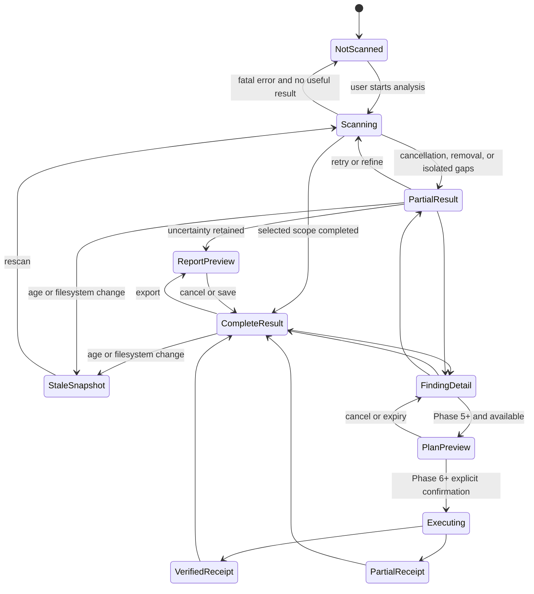

# UX State Machine

## Purpose

UI state projects domain facts; it cannot replace them. Scan status, snapshot freshness, measurement certainty, coverage, finding presence, disposition, action availability, privilege, rollback, and execution outcome are independent. CLYR never flattens them into a single “ready” or “healthy” state.

## Top-level journey



Source: `docs/diagrams/ux-state-machine.mmd`. PlanPreview, Executing, and receipts are future contracts, not Phase 0 features.

## Orthogonal dimensions

| Dimension | Values | UI obligation |
|---|---|---|
| Scan | Not scanned, Discovering, Scanning, Aggregating, Classifying, Persisting, Complete, Partial, Cancelled, Failed, DriveRemoved | Name current work and remaining trust; Partial never looks Complete. |
| Snapshot | Current, Stale, Incompatible, Corrupt/recovered, Deleted | Require refresh where evidence matters and explain comparison limits. |
| Measurement | Exact, Lower bound, Estimated, Unavailable | Badge each value; expose method and coverage. |
| Coverage | Observed, Skipped, Inaccessible, Unsupported, Reparse-protected, Cloud-metadata-only | Show counts/reasons and avoid precise whole-volume inference. |
| Finding presence | Present, Stale evidence, No longer present | Disable plans until refresh; preserve historical explanation separately. |
| Disposition | Safe candidate, Review required, Move candidate, Protected, Unknown | Calm text; never infer from size/color. |
| Recommendation | Report only, Manual instructions, Executable (future), Unsupported | Explain why and the phase/capability prerequisite. |
| Privilege | Standard user, Requires elevation, Elevation denied/unavailable | Elevation applies only to one confirmed batch. |
| Rollback | Not applicable, Windows-controlled, Available, Unavailable, Completed | State ownership and limits before confirmation. |
| Outcome | Planned, Confirmed, Validating, Executing, Verifying, Completed, PartiallyCompleted, Failed, RollbackAvailable, RolledBack | Show per-item truth and measured recovery. |

## Scan-state presentation

- **Not scanned:** no historical value is implied current.
- **Scanning:** values say “observed so far”; cancellation remains available; focus does not jump with rankings.
- **Partial result:** persistent text names cancellation/removal/inaccessible causes, coverage, and unavailable comparisons/actions.
- **Complete result:** means selected scope completed, not that privileged/inaccessible/excluded content was observed. Coverage remains adjacent.
- **Stale snapshot:** historical data remains viewable but cannot create a plan. The age, volume, rule, or mutation trigger is named.
- **No longer present:** the historical finding remains non-actionable; it is not described as a successful cleanup.

## Finding lifecycle

```text
Observed -> Protected | Unknown | Candidate
Candidate -> Report only | Review required | Move candidate | Safe candidate
any potentially actionable presentation -> Stale -> refreshed Observed | No longer present
```

Protected is terminal for generic rule actions. Unknown cannot be promoted without new evidence. Safe candidate stays unselected and report-only in early/beta phases.

## Future action state

```text
Planned -> Confirmed -> Validating -> Executing -> Verifying
-> Completed | PartiallyCompleted | Failed | RollbackAvailable | RolledBack
```

An immutable plan expires ten minutes after creation. Any changed selection, target identity/link/size/time/root evidence, rule-pack/version, action parameters, consequence, privilege, or expiry requires a new plan and confirmation. Confirmation is not reusable authority.

- **Report only:** no confirmation control; show evidence and why execution is absent.
- **Executable:** appears only in Phase 6+ when adapter, capability, and tests permit it.
- **Requires elevation:** UAC follows exact confirmation; denial returns safely with no retry.
- **No rollback:** named before confirmation with proportionate acknowledgement; permanent deletion remains Prohibited.
- **Completed with verification:** receipt and measured free-space delta are available; variance is explained.
- **PartiallyCompleted:** per-item effects, failures, unknowns, and recovery/rollback remain visible; never shown as Completed.

## Determinism and recovery

One reducer/view-model state owner processes typed events. Invalid transitions are rejected and logged without raw paths. Terminal events are idempotent; navigation never mutates domain state. On restart, journals/receipts are reconciled before presenting an outcome. Missing evidence yields Unknown or Review required, never assumed success.

## Test contract

Phase 1 tests demo/view-model transitions without drives. Later suites cover cancellation at every scan state, progress throttling, partial persistence, stale/no-longer-present findings, incompatible history, plan expiry/change, elevation denial, crash during every future action state, partial completion, verification mismatch, rollback, accessible announcements, and duplicate/invalid events.

## Acceptance criteria

- Every required trust state has distinct visible text and accessible semantics.
- Complete, exact, safe, executable, verified, and rollback-available are never inferred from one another.
- Invalid/stale evidence cannot enable execution.
- Partial/failure states retain useful verified information without overstating it.
- State names agree with domain, workflow, Mermaid, schema, and safety documents.
