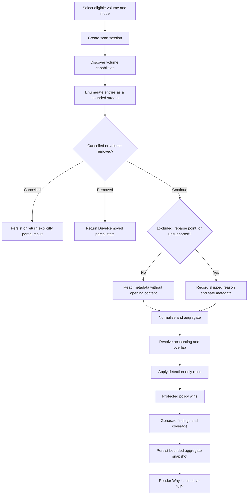
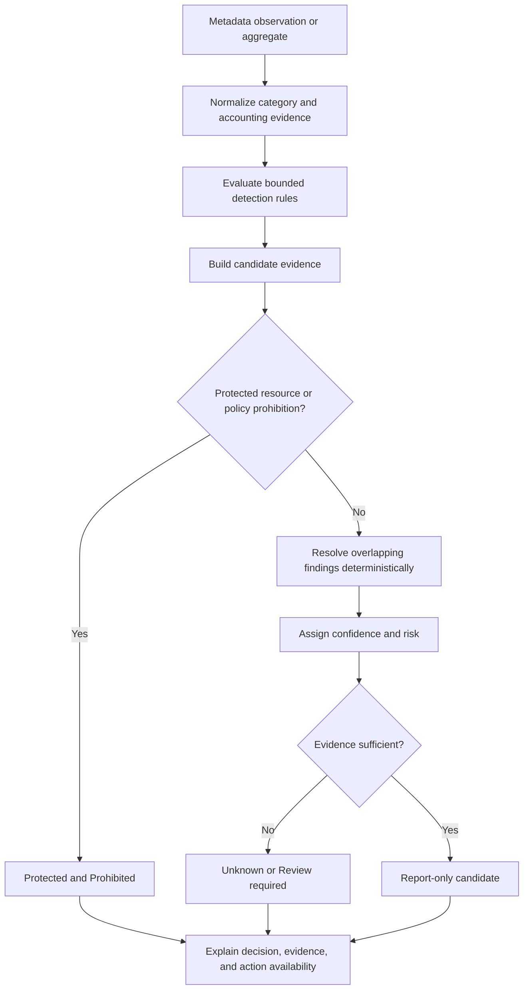
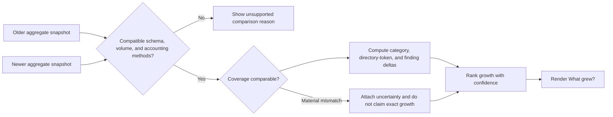
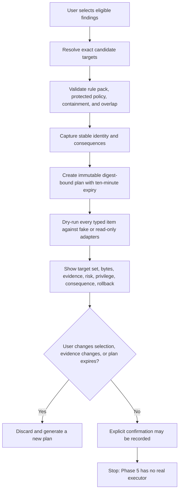
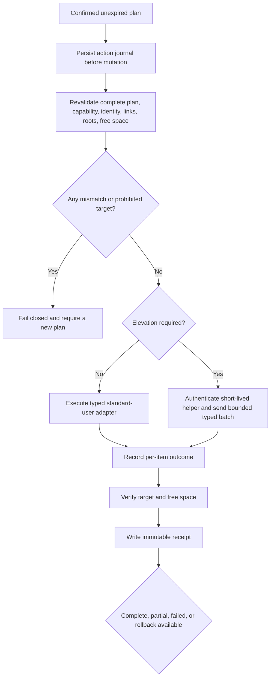
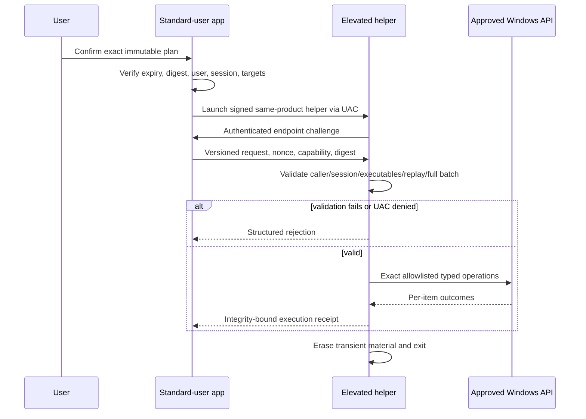
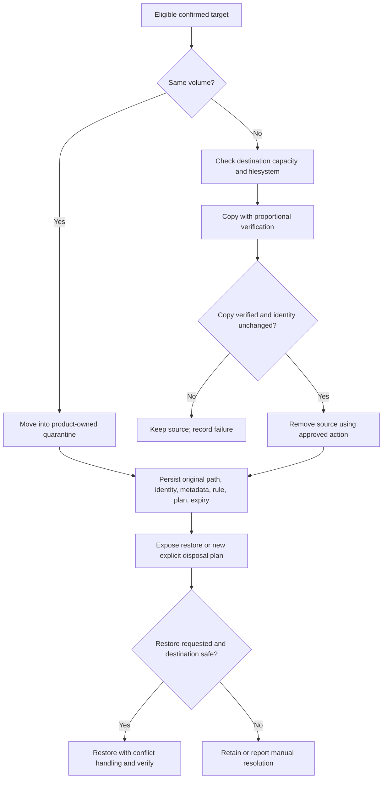
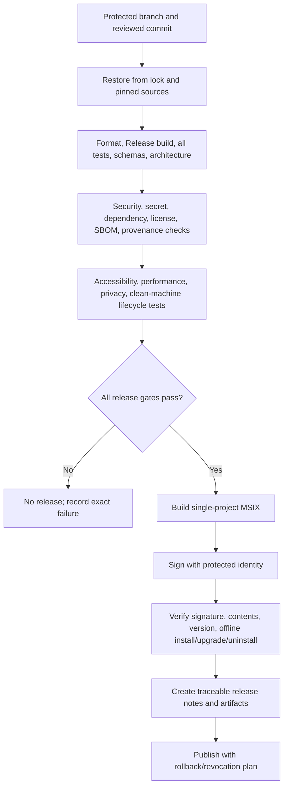

# Workflows

These workflows describe planned end-to-end behavior. Solid arrows apply to read-only phases; cleanup, elevation, rollback, and release steps are future gated designs and are not implemented in Phase 0.

## Scan

Source: `docs/diagrams/scan-workflow.mmd`.

## Finding generation

Protection is evaluated after trusted path/capability normalization and before display or any future plan. Size and age are evidence attributes, not safety proof.

## Snapshot and “What grew?”

Incomplete scans can be compared only with visible coverage caveats. The future USN provider accelerates observation but never replaces a complete fallback.

## Cleanup dry run — Phase 5 only

## Cleanup execution — Phase 6 or later

No permanent-delete action exists. Partial completion is never summarized as all-or-nothing success.

## Elevation — Phase 6 or later

A pipe/localhost endpoint alone is not authentication. The helper never listens persistently and accepts no free-form command or path outside the validated action contract.

## Quarantine and rollback — Phase 6 or later

Expiry never silently deletes quarantined content. Credentials, protected/system content, EFS, cloud content that would hydrate, and unknown application databases are ineligible without specialized review.

## Rule contribution

```mermaid
flowchart LR
    A[Proposal and synthetic fixture] --> B[Schema and bounded-parser validation]
    B --> C[Protected-path and malicious-input tests]
    C --> D[Evidence, privacy, overlap, and false-positive review]
    D --> E[Maintainer and sensitive-owner review]
    E --> F[Merge as versioned report-only rule]
    F --> G[Build manifest hashes and optional later signature]
    G --> H[Local schema, hash, compatibility, and policy validation]
    H --> I[Detection and explanation]
    I -. Phase 5+ approved adapter reference .-> J[Plan validation]
    J -. Phase 6+ .-> K[Execution receipt]
```

## Release — Phase 9 or later

No release workflow exists in Phase 0. Tags, publication, Store/WinGet submission, and update activation require explicit authorization and Phase 9 gates.

## Workflow acceptance criteria

- Every diagram distinguishes current read-only work from future actions.
- Cancellation, partial results, expiry, validation failure, elevation denial, and partial execution have explicit paths.
- Protected policy and identity validation cannot be bypassed by a rule or confirmation.
- User confirmation does not authorize changed targets.
- Release publication cannot occur after a failed gate.
